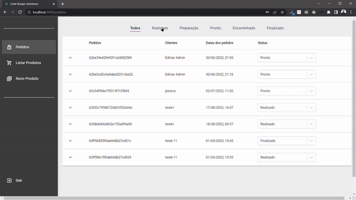

# Burger shop 
## Front-end of a full-stack application
 
<h2>Completed full-stack student project</h2>
 
=> Result of the finished project. This project had as its main objective, the creation of complete e-commerce, 
where most aspects of the business rules, both the customer side and the service provider company side are addressed.
It was a challenging and fun application to develop, where I learned to deal with several new tools and perfected several soft skills.
Dealing with the infrastructure part to deploy took me a long time and for that, I needed to go in search of knowledge about some technologies,
which was also great for me.
 
 
 
 

<table align="center">
  <tr>
    <td>
      
    </td>
    <td>
      
    </td>
  </tr>
</table>
 
 

 <a href="https://e-commerce-burgershop.onrender.com" >Click here to try it out .. thanks for your interest!</a>
 
( Select Ctrl + click for open in new tab )

  
  

### Adjustments and improvements

The project was fully completed and some of the resources used were:

- [x] 
- [x] 
- [x] 
- [x] 
- [x] 
- [x] 
- [x] 
- [x] 
- [x] 

## 🤝 Collaborators

<table>
  <tr>
    <td align="center">
      <a href="https://www.linkedin.com/in/edmar-radanovis-0130b611a/">
         
      
        <b>Edmar Radanovis</b>
      
      </a>
    </td>
    <td align="center">
      <a href="https://rodolfomori.com.br/devclub/">
         
      
        <b>Dev Club</b>
      
      </a>
    </td>
  </tr>
</table>

[⬆ Voltar ao topo](#burger-shop) 
